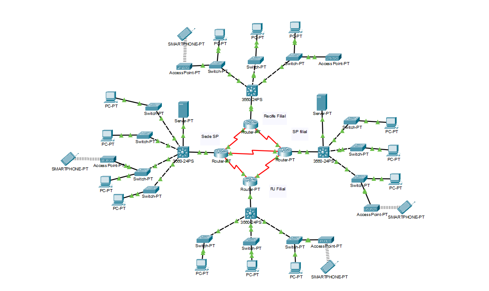

# 🎮 Tupã Studios - Infraestrutura de Rede Corporativa

> Projeto de infraestrutura de TI, segurança e conectividade para um estúdio de jogos em expansão.

## 📄 Sobre o Projeto
Este projeto simula o ambiente de TI da **Tupã Studios**, uma empresa fictícia de desenvolvimento de jogos com **210 colaboradores** distribuídos em 4 localidades estratégicas (São Paulo Matriz, São Paulo II, Rio de Janeiro e Recife).

O objetivo foi desenhar uma rede robusta, escalável e segura, garantindo baixa latência para a equipa de desenvolvimento e proteção da Propriedade Intelectual (IP).

## 🛠️ Tecnologias e Conceitos Aplicados
* **Design de Rede:** Topologia Hub-and-Spoke (Conectividade centralizada).
* **Segurança:** Implementação de Firewall, segmentação por VLANs e VPNs Site-to-Site.
* **Protocolos:** OSPF para roteamento dinâmico, DHCP, DNS.
* **Hardware:** Dimensionamento de servidores On-Premise e Workstations de alta performance (Ryzen/Intel i9).
* **Ferramentas:** Cisco Packet Tracer 8.0, Microsoft Office 365.

## 📸 Topologia da Rede

### Visão Geral (Hub-and-Spoke)

*A arquitetura conecta as filiais ao Hub central em SP, garantindo redundância.*

### Detalhe da Segmentação (VLANs)
A rede foi segregada para garantir segurança e performance:
* **VLAN 10:** Desenvolvimento (Prioridade de tráfego)
* **VLAN 20:** Marketing
* **VLAN 30:** Administrativo/Financeiro
* **VLAN 99:** Gestão

## 📂 Estrutura do Repositório
* `/src`: Ficheiro fonte `.pkt` (Cisco Packet Tracer) para simulação.
* `/docs`: Documentação técnica completa (PDF) e Apresentação Executiva.

## 🚀 Como Executar
Para visualizar a simulação da rede:
1. Instale o [Cisco Packet Tracer](https://www.netacad.com/courses/packet-tracer).
2. Baixe o arquivo `Tupa_Studio_V2.0.pkt` na pasta `/src`.
3. Abra o arquivo e verifique a conectividade entre as filiais enviando um PDU (Ping).

---
**Autores:**
Desenvolvido por Kaique Dias, e equipe acadêmica da Universidade São Judas Tadeu.
